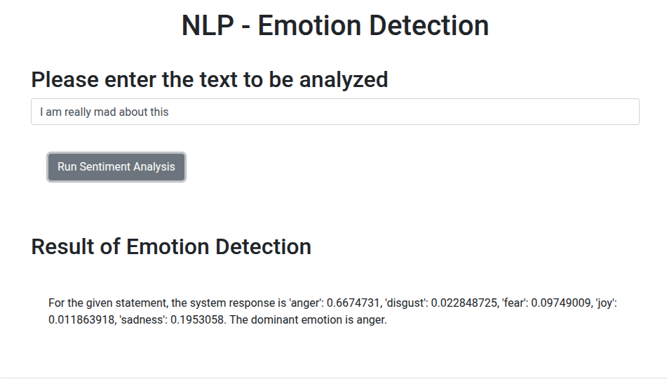

# AI Emotion Detector Web App


[](https://python.org)
[](https://flask.palletsprojects.com/)
[](https://docker.com)
[](https://www.ibm.com/watson)
[](https://opensource.org/licenses/Apache-2.0)

## Introduction

This project is a **Full-Stack AI Application** that detects and quantifies emotions from text input. 

Leveraging **IBM Watson's Embeddable AI** libraries, it goes beyond simple sentiment analysis (positive/negative) to identify fine-grained emotional states. The application is containerized with Docker, ensuring consistency across development and production environments.

**Key Capabilities:**
* **Fine-Grained Analysis:** Detects specific emotions: 😊 Joy, 😢 Sadness, 😡 Anger, 😨 Fear, and 🤢 Disgust.
* **Microservice Architecture:** Decoupled backend (Flask) and frontend logic.
* **Production Ready:** Fully containerized using Docker and orchestrated via Docker Compose.

### 📉 Use Cases
Such emotion-aware systems are critical for:
* **Customer Experience:** Automated triage of angry support tickets.
* **Market Research:** Analyzing product reviews for specific pain points.
* **Mental Health:** Early detection of distress signals in text.

## Technologies & Architecture

| Component | Technology | Description |
|-----------|------------|-------------|
| **AI Engine** | **IBM Watson NLP** | Library for emotion extraction logic. |
| **Backend** | **Flask (Python)** | REST API handling requests and logic. |
| **Frontend** | **HTML/JS/AJAX** | Asynchronous UI for real-time results. |
| **Container** | **Docker** | Ensures portability and easy deployment. |
| **Testing** | **Unittest** | Python's built-in framework for logic validation. |


## Project Structure

The project follows a modular structure suitable for microservices:

```text
final-project-emb-ai/
├── backend/
│   ├── EmotionDetection/   <- AI Logic Package
│   │   ├── __init__.py
│   │   └── emotion_detection.py
│   ├── server.py           <- Flask Application Entrypoint
│   ├── requirements.txt    <- Python Dependencies
│   └── Dockerfile          <- Container Definition
├── frontend/
│   ├── index.html          <- User Interface
│   └── static/             <- Client-side Assets
│       └── mywebscript.js
└── docker-compose.yml      <- Orchestration Config
```

---

### 🚀 How to Run
​
**Prerequisites**

​Docker & Docker Compose installed.
​An active IBM Watson library or API Mock (as configured in the course).

**​1. Clone the Repository**

```bash
git clone [https://github.com/your-username/final-project-emb-ai.git](https://github.com/your-username/final-project-emb-ai.git)
cd final-project-emb-ai
```

**2. Deployment with Docker**

​The easiest way to run the application is to use Docker Compose, which automatically builds the image and maps the ports.

```bash
docker-compose up --build
```

**3. Access the Application**
​Once the container is running, open your browser:
👉 http://localhost:5000

### ​🧪 Testing
​Unit tests are included to ensure the reliability of the emotion detection logic. To run tests inside the container (or locally):

```bash
# If running locally with python installed
python3 -m unittest backend/EmotionDetection/test_emotion_detection.py

# OR via Docker (if configured)
docker exec -it <container_id> python3 -m unittest discover
```

### 📊 Example Output

​Input Text:
​"I am really mad about this service!"
**​System Response:**

```json
{
  "anger": 0.85,
  "disgust": 0.05,
  "fear": 0.03,
  "joy": 0.01,
  "sadness": 0.06,
  "dominant_emotion": "anger"
}
```
<br>
<p align="center">
  
</p>
<br>

<!--
**GIF Demonstration:**


-->

### ⚖️ License

This project is licensed under the Apache 2.0 License.
Based on the curriculum for the IBM DevOps and Software Engineering Professional Certificate.

<!--
# Project Emotion Detector

## Introduction

This project demonstrates the end-to-end development of a **machine learning-powered web application**, including:

* **Backend development** with Flask.
* **Frontend integration** with HTML, JavaScript, and Flask templates.
* **Deployment using Docker** for easy portability.
* **Unit testing** to ensure the reliability of the emotion detection logic.

The project leverages **IBM Watson’s embeddable AI services** to extract emotions from user-provided text.

Unlike traditional sentiment analysis (which only identifies polarity: positive, negative, or neutral), **emotion detection** captures more **fine-grained emotions** such as:

* 😊 Joy
* 😢 Sadness
* 😡 Anger
* 😨 Fear
* 🤢 Disgust

Such emotion-aware systems are increasingly important in:

* Customer feedback analytics.
* AI-driven recommendation engines.
* Automated chatbots with empathetic responses.
* Market research and consumer insights.

## Technologies Used

### **Backend**

* [Python 3.10+](https://www.python.org/)
* [Flask](https://flask.palletsprojects.com/) – lightweight web framework.
* [Requests](https://pypi.org/project/requests/) – HTTP client for Watson API.

### **Frontend**

* HTML5
* CSS3
* JavaScript (AJAX for async communication with backend)

### **DevOps / Deployment**

* [Docker](https://www.docker.com/) – containerization of the application.
* [Docker Compose](https://docs.docker.com/compose/) – orchestration.
* [GitHub Action](https://github.com/features/actions) - CI/CD

### **Testing**

* [unittest](https://docs.python.org/3/library/unittest.html) – Python’s built-in test framework.

## Project Structure

```
final-project-emb-ai/
├── backend/
│   ├── EmotionDetection/
│   │   ├── __init__.py
│   │   └── emotion_detection.py
│   ├── server.py
│   ├── requirements.txt
│   └── Dockerfile
├── frontend/
│   ├── index.html
│   └── static/
│       └── mywebscript.js
└── docker-compose.yml
```

## How to Run the Project

### 1. Clone the Repository

```bash
git clone https://github.com/your-username/final-project-emb-ai.git
cd final-project-emb-ai
```

### 2. Run with Docker Compose

```bash
docker-compose up --build
```

### 3. Access the App

Open your browser at 👉 [http://localhost:5000](http://localhost:5000)

## Example Output

For the given input:

```
I am really mad about this
```

The system response is:

```
'anger': 0.85, 'disgust': 0.05, 'fear': 0.03, 'joy': 0.01, 'sadness': 0.06
The dominant emotion is: anger
```


**GIF Demonstration:**


---

## Takeaway

This project showcases how **AI + Web Development + Docker** can be combined to deliver a scalable, production-ready solution.

It serves as a strong foundation for:

* Building emotion-aware chatbots.
* Enhancing customer support systems.
* Running analytics on customer feedback at scale.
-->


